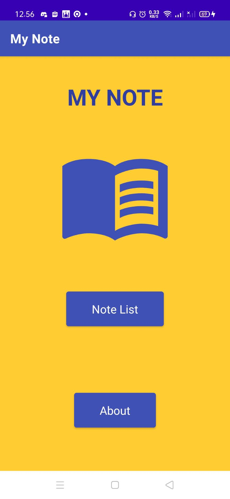
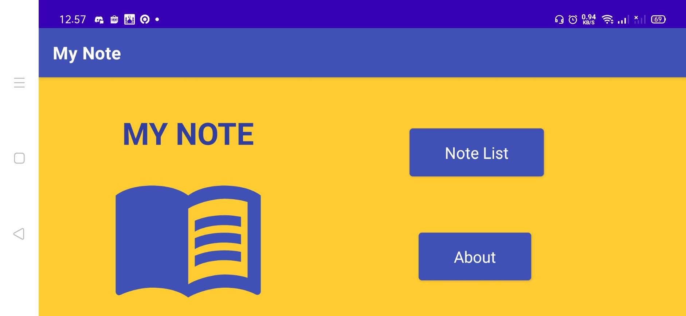
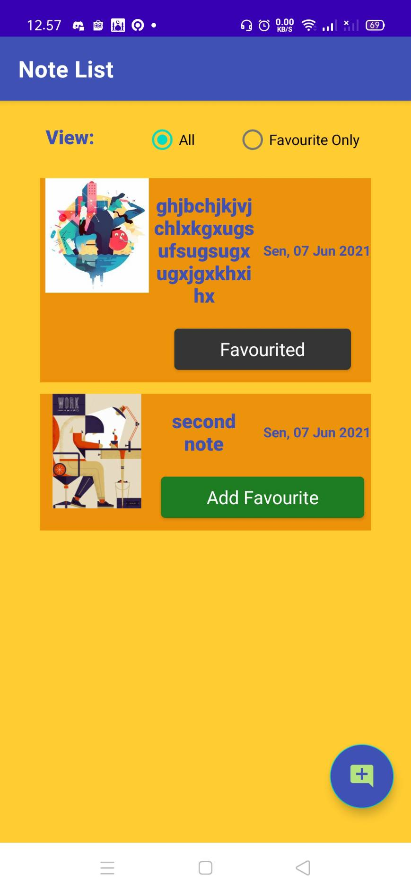
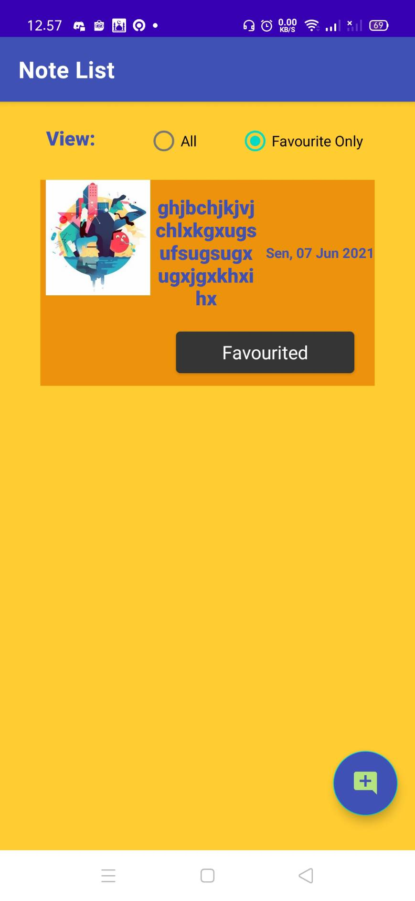
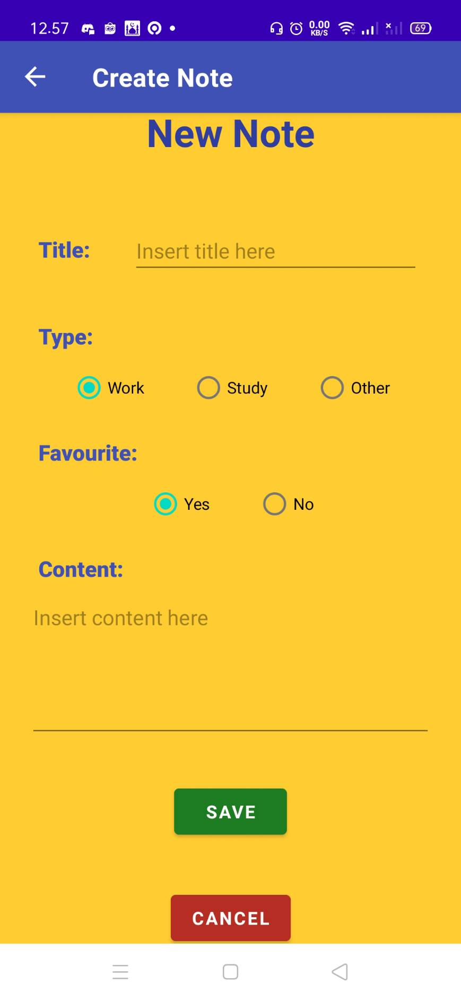
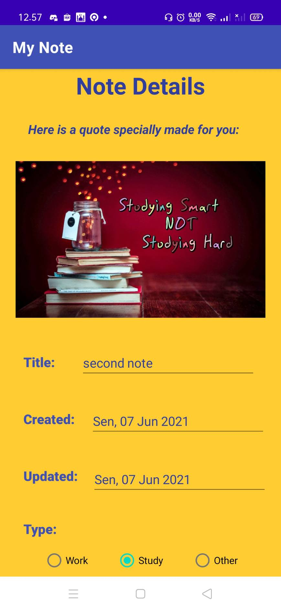
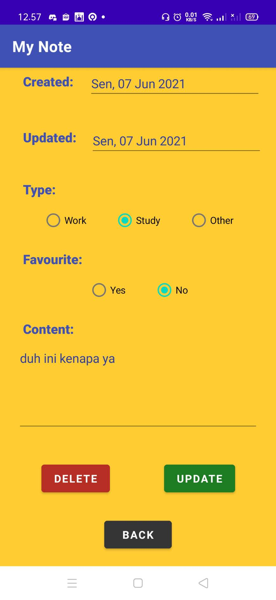

# My Note
## Description
-------
A simple android-based app that could write your notes, also categorizing it into some categories, and classify it into favourite or not. These notes that you already written are editable and deletable, too.

## Requirement
-------
These are some requirement app(s) and device(s), that you probably will need, to use this app.

### For development
-------

1. Android Studio, here I use Android Studio Arctic Fox (2020.3)
2. JDK, this project using JDK v1.8 (JDK 8)
3. Android SDK, this project using SDK version 30
4. Kotlin, this project using Kotlin v1.5.10
5. Gradle, this project using Gradle v7.x
6. Android device or use AVD (Android Virtual Device)

### For running APK
-------

1. Device with Android OS, this would run best with Android API version 26+, but with API version 16+ could run it too with some limitation I think

## Features
-------
Features will be described as page, they are

1. Main Page, which display app name and it's logo. It also has two button, one for going to note list page, and one for about page. Fyi, this page is responsive, so you could see it when the screen is landscaped!

    

    

2. About Page, displaying information about programmer (myself).
   
    

3. Note List Page, displaying our notes using recycler view, basic info about notes are shown, and can be clicked to go to details page. You could also click favourite button to toggle favourite status, as the list could filter favourite only note. There is also floating button to go to note creator page.
   
    

    

4. Note Creator Page, displaying for that could be filled to create new note. When you pressed the button, you are going to be confirmed with an alert dialog.
   
    

5. Note Details Page, shows all details about the note, as some fields are editable. The edit could be saved, or delete the note. Here, quotes (as an image) are shown. The Action that you have taken are going to be confirmed with an alert dialog.
   
    

    

## Issues
-------
So far, no significant issues has been found, yet.

## Contributor
-------
[Naufal Prima Yoriko](https://github.com/primayoriko)
